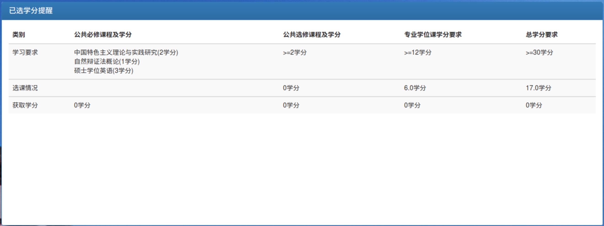
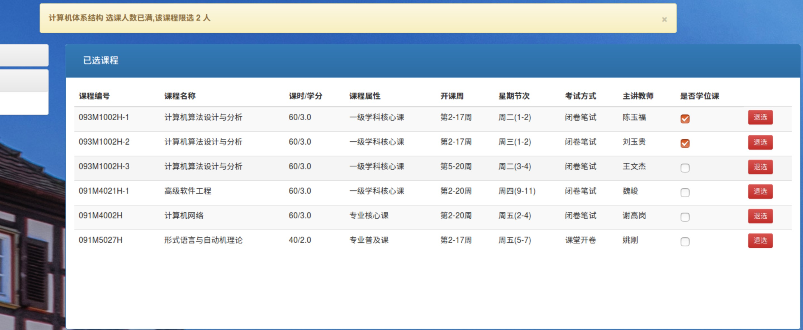
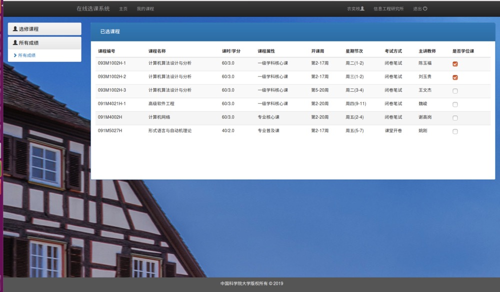
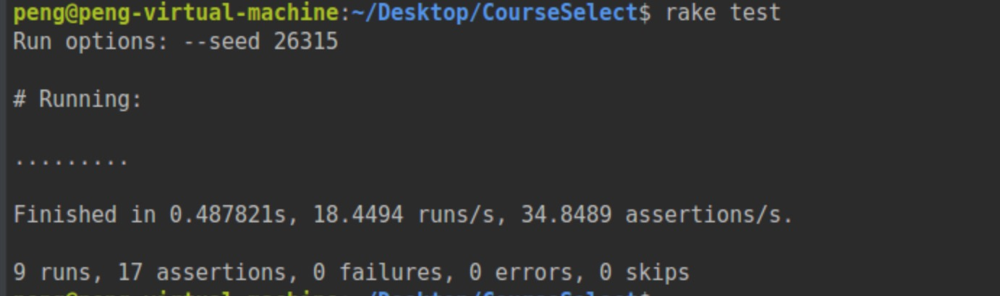
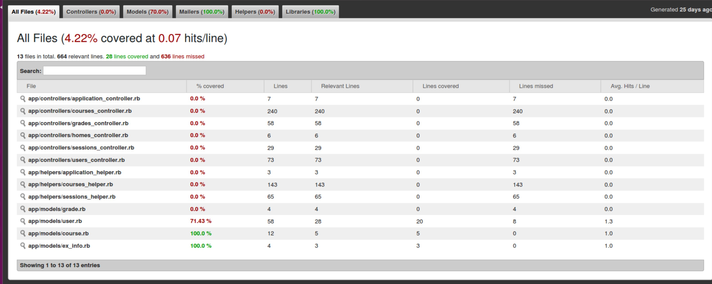

# CourseSelect [](https://travis-ci.com/KeepInMemory/CourseSelect)

演示demo看[这里](https://ucascs.herokuapp.com/)
本系统是基于[校园选课系统样本](https://github.com/PENGZhaoqing/CourseSelect) 开发


### 原选课系统功能：

* 多角色登陆（学生，老师，管理员）
* 学生动态选课，退课
* 老师动态增加，删除课程
* 老师对课程下的学生添加、修改成绩
* 权限控制：老师和学生只能看到自己相关课程信息

### 新增功能：

* 选课冲突处理
* 选课学分提示
* 学位课/非学位课设置
* 选课开放与关闭


### 截图










## 说明

目前使用的库和数据库：

* 使用[Bootstrap](http://getbootstrap.com/)作为前端库
* 使用[Rails_admin Gem](https://github.com/sferik/rails_admin)作为后台管理
* 使用[Postgresql](http://postgresapp.com/)作为数据库

使用前需要安装Bundler，Gem，Ruby，Rails等依赖环境。

请根据本地系统下载安装[postgresql](https://devcenter.heroku.com/articles/heroku-postgresql#local-setup)数据库，并运行`psql -h localhost`检查安装情况。


## 安装

在终端（MacOS或Linux）中执行以下代码

```
$ git clone https://github.com/KeepInMemory/CourseSelect.git
$ cd CourseSelect
$ bundle install
$ rake db:migrate:reset
$ rake db:seed
$ rails s 
```

在浏览器中输入`localhost:3000`访问主页

## 使用

1.学生登陆：

账号：`student1@test.com`

密码：`password`

2.老师登陆：

账号：`teacher1@test.com`

密码：`password`


3.管理员登陆：

账号：`admin@test.com`

密码：`password`

账号中数字都可以替换成2,3...等等


## 本地测试

本项目包含了部分的测试（integration/fixture/model test），测试文件位于/test目录下。一键运行所有测试使用`rake test`：




### 模型测试

以用户模型为例, 位于`test/models/user_test.rb`, 首先生成一个`@user`对象，然后`assert`用户是否有效，这里的调用`valid`方法会去检查你的模型中的相关的`validates`语句是否正确，若`@user.valid?`为false, 那么此`assert`会报错，代表`"should be valid"`这条测试没有通过, 单独运行此测试文件使用`rake test test/models/user_test.rb`


```
class UserTest < ActiveSupport::TestCase
  # test "the truth" do
  #   assert true
  # end

  def setup
    @user = User.new(name: "Example User", email: "user@example.com", password: "password", password_confirmation: "password")
  end

  test "should be valid" do
    assert  @user.valid?
  end

  ...

end
```

### 视图和控制器测试

以用户登录为例，位于`test/integration/user_login_test.rb`，首先同样生成一个@user模型，这个@user的用户名和密码可以在`test/fixtures/users.yml`中指定, 然后我们用get方法到达登录页面（sessions_login_path），然后使用post方法提交这个@user的账号密码来登录，如果登录成功，当前应该会跳转至homes控制器下的index方法进行处理，`assert_redirected_to`能判断这个跳转过程是否发生，然后调用`follow_redirect！`来紧跟当前的跳转，用`assert_template`来判读跳转后的视图文件是否为`homes/index`, 最后在这个视图文件下做一些测试，比如判断这个视图下连接为root_path的个数等等（根据当前登录的角色不同，当前的页面链接会不同，比如admin用户就会有控制面板的链接rails_admin_path，而普通用户没有，因此可以根据链接的个数来判断当前登录用户的角色）

```
class UserLoginTest < ActionDispatch::IntegrationTest

  def setup
    @user = users(:peng)
  end

  test "login with valid information" do
    get sessions_login_path
    post sessions_login_path(params: {session: {email: @user.email, password: 'password'}})
    assert_redirected_to controller: :homes, action: :index
    follow_redirect!
    assert_template 'homes/index'
    assert_select "a[href=?]", root_path, count: 2
    assert_select "a[href=?]", rails_admin_path, count: 0
  end
end
```

### 测试涵盖率检测

我们可以使用[simplecov](https://github.com/colszowka/simplecov/)库来检测我们编写的测试对于我们的项目是否完整，步骤如下：

1. 在Gemfile文件中导入simplecov库：`gem 'simplecov', :require => false, :group => :test`，然后`bundle install`安装
2. 在test/test_helper.rb的最前面加入simplecov的启动代码（这里默认使用rails自带的test框架，simplecov也支持其他测试框架如rspec，那么启动代码导入的位置请参考simplecov的官方文档）

  ```
  # 注意这里必须在 require rails/test_help 之前加入，否则不会生效
  require 'simplecov'
  SimpleCov.start 'rails'

  ENV['RAILS_ENV'] ||= 'test'
  require File.expand_path('../../config/environment', __FILE__)
  require 'rails/test_help'

  class ActiveSupport::TestCase
    # Setup all fixtures in test/fixtures/*.yml for all tests in alphabetical order.
    fixtures :all

    # Add more helper methods to be used by all tests here...
  end
  ```

3. 运行`rake test`,成功后会根目录的coverage下生成一个index.html文件，用浏览器打开能看到结果如下：




